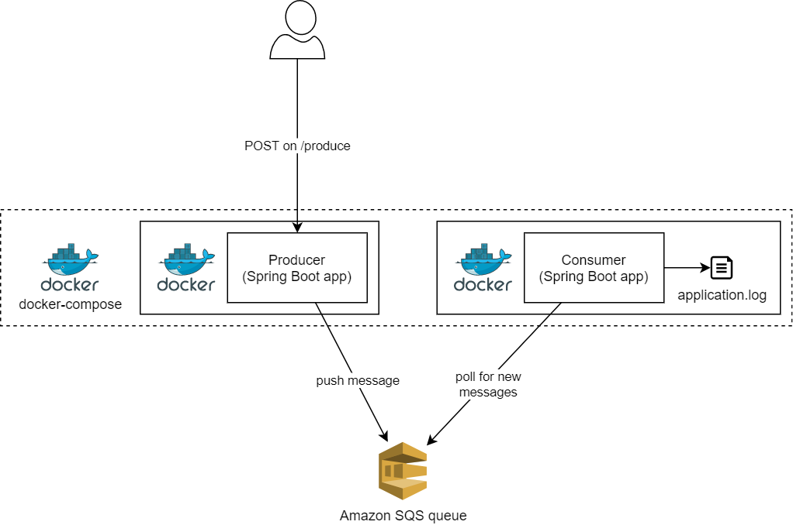

# Producer-consumer using Spring Boot and Docker

This project is a minimal example of a Spring Boot producer-consumer stack connected via Amazon SQS and run using Docker compose.



## Building and running the stack

### Pre-requisites

**AWS Credentials**

This service uses [Amazon SQS](https://aws.amazon.com/sqs/) and requires valid API credentials. 

The credentials:

1. Must be defined in `$HOME/.aws/credentials` as profile. The profile name must match the one defined in [application.yaml](./producer/src/main/resources/application.yml).
1. Must have write permissions for Amazon SQS

**Amazon SQS queue**

An Amazon SQS queue must exist:

 * with the name defined in [AppConfig](./producer/src/main/java/com/example/producer/AppConfig.java) and in the AWS region defined 
 * in the AWS region defined in [application.yaml](./producer/src/main/resources/application.yml)


### With Docker

```sh
docker-compose build
```

```sh
docker-compose up
```

### Running the services individually or without Docker

See the READMEs in the service directories:

 - [producer](./producer/README.md)
 - [consumer](./consumer/README.md)

## Seeing it in action

Tail the log on the consumer.

```sh
docker exec consumer tail -f logs/application.log
```

Make a POST call against localhost:8080/produce with a message body to trigger the producer and see the output in the log of the consumer.

```sh
curl -X POST -d "hey there!" localhost:8080/produce
```

```text
[INFO ] 2021-01-02 15:09:34.289 [simpleMessageListenerContainer-2] ConsumerApplication - Got message: hey there!
```